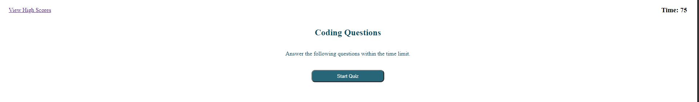
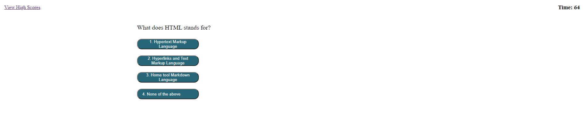
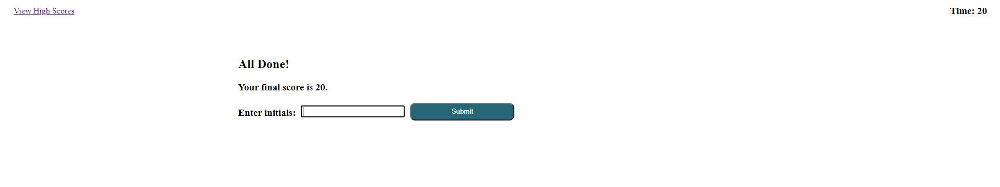
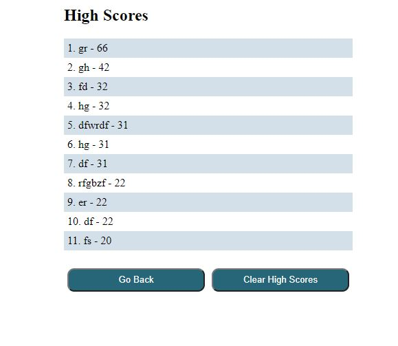

# Build a Coding Quiz 

# Getting Started
This is a homework for University of Oregon Bootcamp.
It emphasize the use of javascript and DOM manipulations.

## Homework at a Glance

There are 5 questions. You will choose which is the correct answer.
When you answer wrong, the timer will deduct 10 to your time.

Once you are done with the quiz, you will be asks to put your initial so it can  be recorded in the high scores.

The high score is based on how fast or quickly you can answer. 

## Homework Criteria

GIVEN I am taking a code quiz
WHEN I click the start button
THEN a timer starts and I am presented with a question
WHEN I answer a question
THEN I am presented with another question
WHEN I answer a question incorrectly
THEN time is subtracted from the clock
WHEN all questions are answered or the timer reaches 0
THEN the game is over
WHEN the game is over
THEN I can save my initials and my score

## To Execute File:

> Open in Browser - preferrably microsoft edge